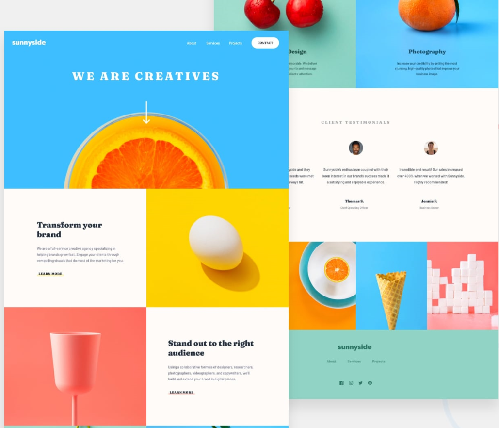

# Frontend Mentor - SUNNYSIDE AGENCY LANDING PAGE SOLUTION

## Table of contents

-  [Overview](#overview)
   -  [The challenge](#the-challenge)
   -  [Screenshot](#screenshot)
   -  [Links](#links)
   -  [Built with](#built-with)
-  [Author](#author)

## Welcome! 👋

Thanks for checking out this front-end coding challenge.

## Overview

This is a solution to the [Sunnyside agency landing page challenge on Frontend Mentor](https://www.frontendmentor.io/challenges/sunnyside-agency-landing-page-7yVs3B6ef).

### The challenge

Users should be able to:

-  View the optimal layout for the site depending on their device's screen size
-  See hover states for all interactive elements on the page

### Screenshot

### Links

-  Live Site URL: [Sunnyside agency landing page solution](https://boymelvs.github.io/sunnyside-agency-landing-page-main)

### Built with

-  HTML
-  Flexbox
-  CSS
-  Javascripts

## Author

-  Frontend Mentor - [Melvin](https://www.frontendmentor.io/profile/boymelvs)
